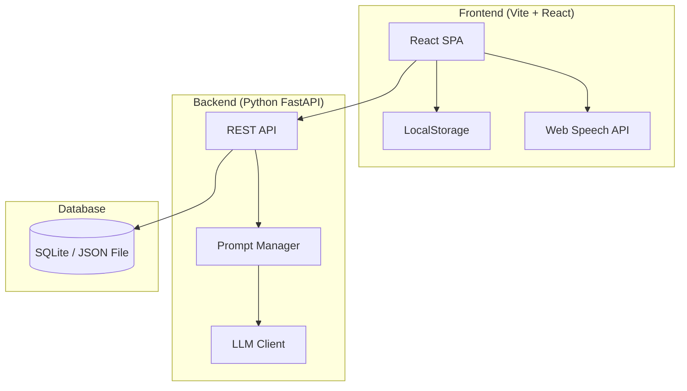

# IELTS Speaking AI Practice App - Implementation Plan

## Overview

Build a mobile-first web application for IELTS speaking practice powered by LLM. The app features a **user-customizable question bank**, **AI-guided personalized answer generation (Practice Mode)**, and **full mock exam simulation with scoring (Mock Exam Mode)**.

## Architecture



---

## Project Structure

```
ielts-speak-learning/
├── frontend/                   # Vite + React
│   ├── public/
│   ├── src/
│   │   ├── assets/             # Icons, images
│   │   ├── components/         # Shared UI components
│   │   │   ├── BottomNav.jsx
│   │   │   ├── AudioWaveform.jsx
│   │   │   ├── ChatBubble.jsx
│   │   │   ├── Timer.jsx
│   │   │   ├── CueCard.jsx
│   │   │   └── ScoreCard.jsx
│   │   ├── pages/
│   │   │   ├── QuestionBank.jsx
│   │   │   ├── PracticeMode.jsx
│   │   │   ├── MockExam.jsx
│   │   │   └── Settings.jsx
│   │   ├── services/
│   │   │   ├── api.js           # Backend API calls
│   │   │   └── speech.js        # Web Speech API wrapper
│   │   ├── stores/
│   │   │   └── useStore.js      # Zustand state management
│   │   ├── styles/
│   │   │   └── index.css        # Global styles + design system
│   │   ├── App.jsx
│   │   └── main.jsx
│   ├── index.html
│   ├── package.json
│   └── vite.config.js
│
├── backend/
│   ├── app/
│   │   ├── __init__.py
│   │   ├── main.py              # FastAPI app entry
│   │   ├── routers/
│   │   │   ├── questions.py     # Question bank CRUD
│   │   │   ├── practice.py      # Practice mode endpoints
│   │   │   └── exam.py          # Mock exam endpoints
│   │   ├── services/
│   │   │   ├── llm_service.py   # LLM API client
│   │   │   └── prompt_templates.py  # Prompt engineering
│   │   ├── models/
│   │   │   └── schemas.py       # Pydantic models
│   │   └── database/
│   │       ├── db.py            # Database connection
│   │       └── crud.py          # Database operations
│   ├── requirements.txt
│   └── data/
│       └── questions.db         # SQLite database
│
└── 雅思口语AI备考应用设计.md
```

---

## Design System (Blue Theme - Inspired by Stitch)

Based on the Stitch project's "Blue" theme screens, the design system uses:

### Color Palette
| Token | Value | Usage |
|-------|-------|-------|
| `--bg-primary` | `#0A0E1A` | Main dark background |
| `--bg-secondary` | `#111827` | Card/panel backgrounds |
| `--bg-elevated` | `#1E293B` | Elevated surfaces, modals |
| `--accent-primary` | `#3B82F6` | Primary blue CTA buttons |
| `--accent-gradient` | `linear-gradient(135deg, #3B82F6, #8B5CF6)` | Key interactive elements |
| `--accent-glow` | `rgba(59, 130, 246, 0.2)` | Glow effects on actions |
| `--text-primary` | `#F8FAFC` | Headings & primary text |
| `--text-secondary` | `#94A3B8` | Labels & descriptions |
| `--text-muted` | `#64748B` | Subtle hints |
| `--success` | `#22C55E` | Prepared/completed states |
| `--warning` | `#F59E0B` | In-progress states |
| `--error` | `#EF4444` | Error/danger states |
| `--border` | `rgba(255,255,255,0.08)` | Subtle borders |

### Typography
- **Font**: `Inter` (Google Fonts) — clean, modern, excellent readability
- **Headings**: 600/700 weight
- **Body**: 400 weight
- **Code/Data**: `JetBrains Mono` for scores

### Components Style
- **Cards**: `border-radius: 16px`, subtle border, glassmorphism backdrop blur
- **Buttons**: rounded-full for primary actions, pill-shaped for tags
- **Bottom Nav**: frosted glass effect with active indicator glow
- **Animations**: smooth 300ms ease transitions, spring-based micro-animations

---

## Proposed Changes

### Backend

#### [NEW] [requirements.txt](file:///Users/lianghaolin/Desktop/ielts-speak-learning/backend/requirements.txt)
- FastAPI, uvicorn, pydantic, httpx, openai, python-multipart, aiosqlite

#### [NEW] [main.py](file:///Users/lianghaolin/Desktop/ielts-speak-learning/backend/app/main.py)
- FastAPI application setup with CORS middleware
- Mount routers for `/api/questions`, `/api/practice`, `/api/exam`

#### [NEW] [schemas.py](file:///Users/lianghaolin/Desktop/ielts-speak-learning/backend/app/models/schemas.py)
- Pydantic models:
  - `Topic` (id, title, part, questions[], status)
  - `Question` (id, text, personal_answer?, topic_id)
  - `PracticeRequest` (question, user_input, target_score, api_key, model)
  - `PracticeResponse` (refined_answer, key_phrases[])
  - `ExamSession` (id, part, transcript[], current_question)
  - `ExamReport` (overall_band, gap_analysis, part_feedbacks, grammar_corrections, better_expressions)

#### [NEW] [db.py](file:///Users/lianghaolin/Desktop/ielts-speak-learning/backend/app/database/db.py)
- SQLite async database connection using `aiosqlite`
- Tables: `topics`, `questions`, `personal_answers`

#### [NEW] [crud.py](file:///Users/lianghaolin/Desktop/ielts-speak-learning/backend/app/database/crud.py)
- CRUD operations for topics, questions, personal answers
- Import/export from JSON/CSV

#### [NEW] [questions.py router](file:///Users/lianghaolin/Desktop/ielts-speak-learning/backend/app/routers/questions.py)
- `GET /api/questions/topics` — List all topics with preparation status
- `GET /api/questions/topics/{id}` — Get topic with questions
- `POST /api/questions/topics` — Create topic
- `POST /api/questions/import` — Bulk import from JSON/CSV
- `PUT /api/questions/{id}/answer` — Save personal answer
- `DELETE /api/questions/topics/{id}` — Delete topic

#### [NEW] [practice.py router](file:///Users/lianghaolin/Desktop/ielts-speak-learning/backend/app/routers/practice.py)
- `POST /api/practice/random-topics` — Random draw (1 Part1 + 1 Part2&3)
- `POST /api/practice/generate-answer` — LLM generates personalized answer
- `POST /api/practice/compare` — Compare user spoken answer with generated answer, give feedback

#### [NEW] [exam.py router](file:///Users/lianghaolin/Desktop/ielts-speak-learning/backend/app/routers/exam.py)
- `POST /api/exam/start` — Start mock exam session
- `POST /api/exam/respond` — Send user response, get examiner's next question
- `POST /api/exam/end` — End exam, get comprehensive scoring report

#### [NEW] [llm_service.py](file:///Users/lianghaolin/Desktop/ielts-speak-learning/backend/app/services/llm_service.py)
- OpenAI-compatible API client (supports user-provided API key & model)
- Async streaming support for real-time responses

#### [NEW] [prompt_templates.py](file:///Users/lianghaolin/Desktop/ielts-speak-learning/backend/app/services/prompt_templates.py)
- Practice Mode prompt (with `[Target Score]` dynamic injection)
- Mock Exam examiner prompt
- Scoring/Report prompt
- All prompts from the design document

---

### Frontend

#### [NEW] [package.json](file:///Users/lianghaolin/Desktop/ielts-speak-learning/frontend/package.json)
- Dependencies: react, react-dom, react-router-dom, zustand, lucide-react

#### [NEW] [vite.config.js](file:///Users/lianghaolin/Desktop/ielts-speak-learning/frontend/vite.config.js)
- Proxy `/api` to backend `http://localhost:8000`

#### [NEW] [index.css](file:///Users/lianghaolin/Desktop/ielts-speak-learning/frontend/src/styles/index.css)
- Complete design system: CSS custom properties, base reset, component styles
- Animations: waveform keyframes, pulse, slide-up, fade-in
- Responsive breakpoints (mobile-first)

#### [NEW] [App.jsx](file:///Users/lianghaolin/Desktop/ielts-speak-learning/frontend/src/App.jsx)
- React Router with 4 routes: `/bank`, `/practice`, `/exam`, `/settings`
- Bottom navigation bar with route-awareness

#### [NEW] [useStore.js](file:///Users/lianghaolin/Desktop/ielts-speak-learning/frontend/src/stores/useStore.js)
- Zustand store for:
  - Settings (apiKey, model, targetScore) — persisted to LocalStorage
  - Current practice session state
  - Current exam session state
  - Question bank cache

#### [NEW] [BottomNav.jsx](file:///Users/lianghaolin/Desktop/ielts-speak-learning/frontend/src/components/BottomNav.jsx)
- 4-tab bottom navigation: Practice, Bank, Exam, Settings
- Active tab indicator with glow animation
- Frosted glass background

#### [NEW] [AudioWaveform.jsx](file:///Users/lianghaolin/Desktop/ielts-speak-learning/frontend/src/components/AudioWaveform.jsx)
- Real-time audio waveform visualization during recording
- Uses Web Audio API AnalyserNode for frequency data
- Animated bars with gradient colors

#### [NEW] [ChatBubble.jsx](file:///Users/lianghaolin/Desktop/ielts-speak-learning/frontend/src/components/ChatBubble.jsx)
- AI/User message bubbles with distinct styling
- Typing indicator animation for AI responses

#### [NEW] [Timer.jsx](file:///Users/lianghaolin/Desktop/ielts-speak-learning/frontend/src/components/Timer.jsx)
- Circular countdown timer with visual progress ring
- Support for prep time (1min) + speaking time (2min) in Part 2

#### [NEW] [CueCard.jsx](file:///Users/lianghaolin/Desktop/ielts-speak-learning/frontend/src/components/CueCard.jsx)
- Part 2 topic card with "You should say" bullet points
- Note-taking area for user preparation

#### [NEW] [ScoreCard.jsx](file:///Users/lianghaolin/Desktop/ielts-speak-learning/frontend/src/components/ScoreCard.jsx)
- Exam results display with 4-criteria radar chart
- Gap analysis section with target vs actual score
- Expandable feedback sections

#### [NEW] [QuestionBank.jsx](file:///Users/lianghaolin/Desktop/ielts-speak-learning/frontend/src/pages/QuestionBank.jsx)
- Accordion list grouped by Part 1 / Part 2&3
- Status badges: "Prepared" (green) / "Not Prepared" (gray)
- Progress bar per topic
- Import button (JSON/CSV upload)
- Add/Edit topic & question inline

#### [NEW] [PracticeMode.jsx](file:///Users/lianghaolin/Desktop/ielts-speak-learning/frontend/src/pages/PracticeMode.jsx)
- **Step 1**: Random topic draw with animation
- **Step 2**: AI-guided answer generation (chat interface)
  - User inputs ideas (text/voice)
  - AI generates polished answer with target score
  - User confirms → saved to question bank
- **Step 3**: Practice speaking (voice input → transcription → comparison)
- Large microphone button at bottom

#### [NEW] [MockExam.jsx](file:///Users/lianghaolin/Desktop/ielts-speak-learning/frontend/src/pages/MockExam.jsx)
- Full exam simulation:
  - Part 1: ID Check + 3 topics (4-5 min timer)
  - Part 2: Cue card display + 1min prep + 2min answer
  - Part 3: Discussion questions (4-5 min timer)
- Voice input with waveform animation
- Exam progress indicator
- End → Score report display

#### [NEW] [Settings.jsx](file:///Users/lianghaolin/Desktop/ielts-speak-learning/frontend/src/pages/Settings.jsx)
- API Key input (password field with toggle visibility)
- Model selector dropdown (gpt-4o-mini, gpt-4o, gpt-3.5-turbo, etc.)
- Target Score slider (5.5 - 8.0+ range)
- Clear local data button with confirmation
- About section

#### [NEW] [api.js](file:///Users/lianghaolin/Desktop/ielts-speak-learning/frontend/src/services/api.js)
- Fetch wrapper for all backend endpoints
- Automatic error handling and loading states

#### [NEW] [speech.js](file:///Users/lianghaolin/Desktop/ielts-speak-learning/frontend/src/services/speech.js)
- Web Speech API wrapper (SpeechRecognition)
- Start/stop recording, get transcript
- Audio visualization hook using Web Audio API

---

## User Review Required

> [!IMPORTANT]
> **Database Choice**: The plan uses SQLite for simplicity. If you need multi-user support or cloud deployment later, we can switch to PostgreSQL. Is SQLite acceptable for V1.0?

> [!IMPORTANT]
> **LLM API**: The app is designed for OpenAI-compatible APIs. The user provides their own API key. Should we also support other providers like Anthropic (Claude) or Google (Gemini) in V1.0?

> [!WARNING]
> **Stitch Designs**: Unable to access the Stitch project directly (requires Google auth). The blue-themed design system is inferred from the screen names. If you have screenshots of the Stitch designs, please share them so I can match the exact styling.

---

## Open Questions

1. **Language**: Should the app UI be in English, Chinese, or bilingual?
2. **Voice Input Provider**: Web Speech API (free, browser-native) vs Whisper API (paid, better accuracy for non-native speakers)? The plan supports both, defaulting to Web Speech API.
3. **Data Persistence**: Should question banks be exportable/shareable between devices?

---

## Verification Plan

### Automated Tests
```bash
# Backend: Run FastAPI tests
cd backend && python -m pytest tests/ -v

# Frontend: Build check
cd frontend && npm run build
```

### Manual Verification
1. **Launch both servers** and verify full flow in mobile browser viewport
2. **Question Bank**: Import sample questions, verify CRUD operations
3. **Practice Mode**: Test AI answer generation with a real API key
4. **Mock Exam**: Run through complete exam flow with all 3 parts
5. **Settings**: Verify LocalStorage persistence across page refreshes
6. **Mobile UX**: Test on iPhone/Android viewport sizes
