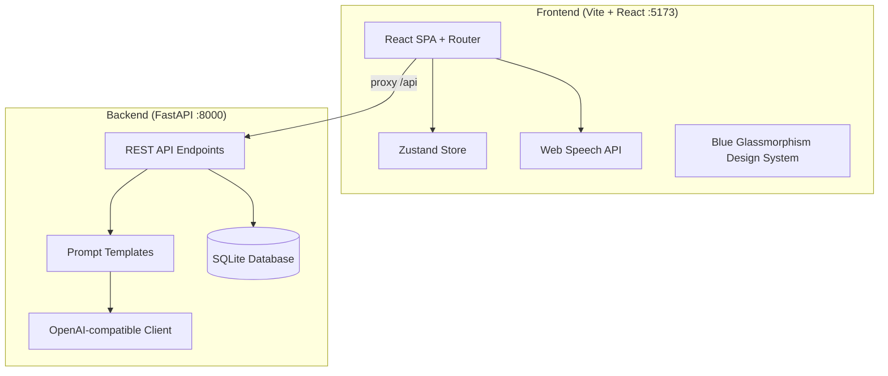

# IELTS Speaking AI Practice App - Walkthrough

## Summary

Built a complete mobile-first web application for IELTS speaking practice, powered by LLM. The app is split into **frontend** (Vite + React) and **backend** (Python FastAPI).

---

## Architecture



---

## Files Created

### Backend (12 files)

| File | Purpose |
|------|---------|
| [requirements.txt](file:///Users/lianghaolin/Desktop/ielts-speak-learning/backend/requirements.txt) | Python dependencies |
| [main.py](file:///Users/lianghaolin/Desktop/ielts-speak-learning/backend/app/main.py) | FastAPI app with CORS & lifespan |
| [schemas.py](file:///Users/lianghaolin/Desktop/ielts-speak-learning/backend/app/models/schemas.py) | All Pydantic request/response models |
| [db.py](file:///Users/lianghaolin/Desktop/ielts-speak-learning/backend/app/database/db.py) | SQLite setup, schema, sample data |
| [crud.py](file:///Users/lianghaolin/Desktop/ielts-speak-learning/backend/app/database/crud.py) | Database CRUD operations |
| [questions.py](file:///Users/lianghaolin/Desktop/ielts-speak-learning/backend/app/routers/questions.py) | Question bank API endpoints |
| [practice.py](file:///Users/lianghaolin/Desktop/ielts-speak-learning/backend/app/routers/practice.py) | Practice mode API endpoints |
| [exam.py](file:///Users/lianghaolin/Desktop/ielts-speak-learning/backend/app/routers/exam.py) | Mock exam API endpoints |
| [llm_service.py](file:///Users/lianghaolin/Desktop/ielts-speak-learning/backend/app/services/llm_service.py) | OpenAI-compatible LLM client |
| [prompt_templates.py](file:///Users/lianghaolin/Desktop/ielts-speak-learning/backend/app/services/prompt_templates.py) | All prompt templates with target score injection |

### Frontend (15 files)

| File | Purpose |
|------|---------|
| [index.css](file:///Users/lianghaolin/Desktop/ielts-speak-learning/frontend/src/index.css) | Complete design system (700+ lines) |
| [App.jsx](file:///Users/lianghaolin/Desktop/ielts-speak-learning/frontend/src/App.jsx) | Router with 4 routes |
| [useStore.js](file:///Users/lianghaolin/Desktop/ielts-speak-learning/frontend/src/stores/useStore.js) | Zustand store with localStorage persistence |
| [api.js](file:///Users/lianghaolin/Desktop/ielts-speak-learning/frontend/src/services/api.js) | Backend API wrapper |
| [speech.js](file:///Users/lianghaolin/Desktop/ielts-speak-learning/frontend/src/services/speech.js) | Web Speech API + Audio visualization |
| [BottomNav.jsx](file:///Users/lianghaolin/Desktop/ielts-speak-learning/frontend/src/components/BottomNav.jsx) | 4-tab frosted glass navigation |
| [AudioWaveform.jsx](file:///Users/lianghaolin/Desktop/ielts-speak-learning/frontend/src/components/AudioWaveform.jsx) | Recording visualization |
| [ChatBubble.jsx](file:///Users/lianghaolin/Desktop/ielts-speak-learning/frontend/src/components/ChatBubble.jsx) | AI/user message bubbles |
| [Timer.jsx](file:///Users/lianghaolin/Desktop/ielts-speak-learning/frontend/src/components/Timer.jsx) | SVG circular countdown timer |
| [CueCard.jsx](file:///Users/lianghaolin/Desktop/ielts-speak-learning/frontend/src/components/CueCard.jsx) | Part 2 topic card with notes |
| [ScoreCard.jsx](file:///Users/lianghaolin/Desktop/ielts-speak-learning/frontend/src/components/ScoreCard.jsx) | Exam results with expandable feedback |
| [QuestionBank.jsx](file:///Users/lianghaolin/Desktop/ielts-speak-learning/frontend/src/pages/QuestionBank.jsx) | Topic management with accordion UI |
| [PracticeMode.jsx](file:///Users/lianghaolin/Desktop/ielts-speak-learning/frontend/src/pages/PracticeMode.jsx) | AI-guided answer generation + speaking practice |
| [MockExam.jsx](file:///Users/lianghaolin/Desktop/ielts-speak-learning/frontend/src/pages/MockExam.jsx) | Full IELTS exam simulation |
| [Settings.jsx](file:///Users/lianghaolin/Desktop/ielts-speak-learning/frontend/src/pages/Settings.jsx) | API key, model, target score config |

---

## Design System

- **Theme**: Dark blue glassmorphism with gradient accents
- **Colors**: Deep navy (#060B18) background, blue (#3B82F6) → purple (#8B5CF6) gradients
- **Typography**: Inter font family, JetBrains Mono for scores
- **Components**: Cards with backdrop blur, animated buttons, frosted glass nav
- **Animations**: Spring-based transitions, pulse effects, typing indicators

---

## Key Features

### 1. Question Bank
- Accordion list grouped by Part 1 / Part 2&3
- Add/delete topics and questions
- Bulk import from JSON
- Preparation status badges (Ready / In Progress / Not Started)

### 2. Practice Mode
- Random topic drawing for Part 1 + Part 2&3
- AI generates personalized answers based on user's ideas
- Target score dynamically adjusts vocabulary/grammar complexity
- Voice recording → transcription → comparison with reference answer
- Save generated answers to question bank

### 3. Mock Exam
- Full 3-part IELTS simulation with AI examiner
- Part 2 cue card display + 1min prep timer + 2min speaking timer
- Part transitions with progress bar
- Comprehensive scoring report: overall band, 4 criteria, gap analysis, grammar corrections, better expressions

### 4. Settings
- API key with secure toggle visibility
- Model selector (GPT-4o-mini, GPT-4o, etc.)
- Target score slider (5.5 - 8.0)
- Custom Base URL for alternative API providers
- Clear local data option

---

## How to Run

```bash
# Terminal 1 - Backend
cd backend
pip install -r requirements.txt
uvicorn app.main:app --host 0.0.0.0 --port 8000 --reload

# Terminal 2 - Frontend
cd frontend
npm install
npm run dev
```

Open **http://localhost:5173** in your browser.

---

## Validation Results

| Check | Status |
|-------|--------|
| Frontend build (`npm run build`) | ✅ Passes |
| Backend imports | ✅ Passes |
| Backend API (`/health`) | ✅ Returns 200 |
| Topics API (`/api/questions/topics`) | ✅ Returns 5 seeded topics |
| API proxy (frontend → backend) | ✅ Working |
| Database auto-initialization | ✅ Creates tables & seeds data |
